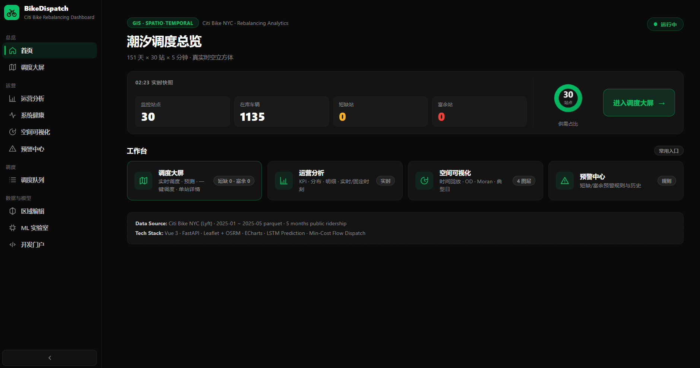
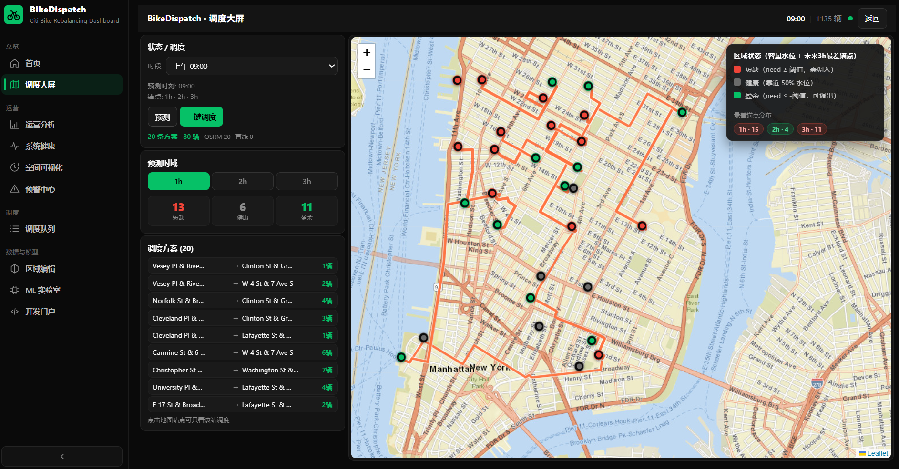
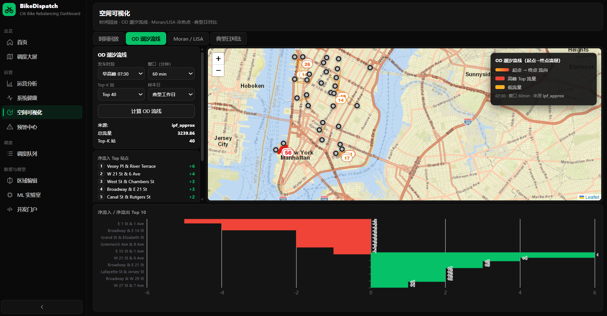
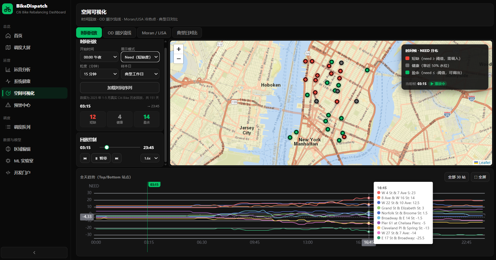
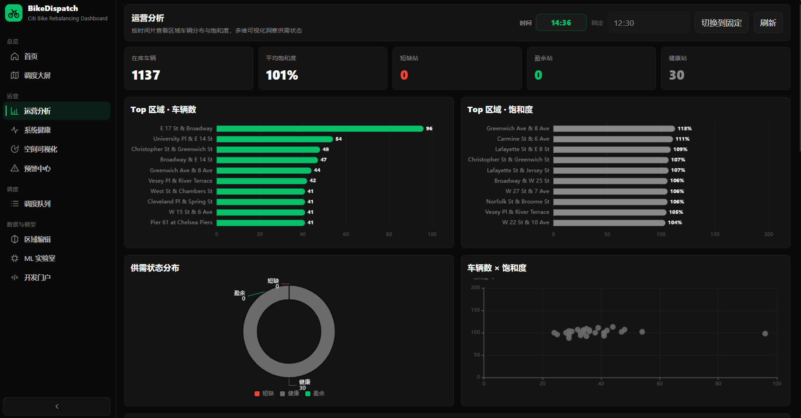

# BikeDispatch · Citi Bike NYC Rebalancing System

> Data-driven bike-sharing rebalancing system — LSTM multi-horizon prediction + min-cost flow dispatch optimization, built on real Citi Bike NYC data.

[](https://vuejs.org/)
[](https://fastapi.tiangolo.com/)
[](https://pytorch.org/)
[](https://www.docker.com/)
[](#license)
[](https://citibikenyc.com/)

---

## Screenshots

<p align="center">
  
  
</p>
<p align="center">
  
  
</p>
<p align="center">
  
</p>

---

## Features

### Prediction
- **Multi-horizon LSTM** — shared encoder + dual head: 1h/2h/3h anchor points + 3h full curve
- **Real data trained** — 2025 Jan–May Citi Bike trips, 151 days × 288 time slots × 30 stations
- **Horizon-aware dispatch input** — worst-horizon shortage/surplus per zone

### Dispatch Optimization
- **Min-cost flow (SSP solver)** — global optimal vehicle rebalancing, 0.01–0.05s per solve
- **OSRM real-street routing** — actual road network distance, not straight-line
- **Greedy fallback** — instant nearest-pair matching when OSRM unavailable
- **11–16% cost reduction** vs greedy baseline at peak hours

### Spatial Analytics (4 layers)
- **Timeline replay** — 24h space-time cube animation, 3 modes (need / ratio / vehicles)
- **OD flow arcs** — gravity + IPF origin-destination matrix reconstruction, top-K flow visualization
- **Moran's I + LISA** — global spatial autocorrelation test + local HH/HL/LH/LL cluster detection
- **Typical day comparison** — weekday vs weekend tidal pattern contrast, peak-shift analysis

### Operations Dashboard
- **Real-time monitoring** — WebSocket live stats, 2s refresh
- **KPI analytics** — shortage/surplus tracking, system health indicators
- **Alert center** — threshold-based alert rules + history
- **Dispatch queue** — task list with embedded route map

### Design
- **Uber 2024 dark UI** — #0A0A0A background, #06C167 single action color
- **Leaflet + ECharts** — interactive maps + analytic charts
- **Responsive layout** — optimized for desktop dashboard use

---

## Quick Start

### Prerequisites
- [Docker](https://docs.docker.com/get-docker/) + Docker Compose
- 4GB+ RAM (OSRM graph building uses ~2GB on first run)

### One-command start

```bash
git clone https://github.com/Dan-Code-11/bike-dispatch-system.git
cd bike-dispatch-system
docker compose up -d --build
```

> First run note: OSRM automatically downloads NYC road network data (~120MB) and builds the routing graph (5–15 minutes). Until ready, the backend falls back to straight-line distance — all other features work immediately.

### Access the app

| Service | URL | Description |
|---------|-----|-------------|
| Frontend | http://localhost:8080 | Main dashboard |
| Backend API | http://localhost:8000/docs | FastAPI Swagger UI |
| OSRM | http://localhost:5000 | Routing engine status |

### Stop

```bash
docker compose down
```

---

## Tech Stack

| Layer | Technology |
|-------|-----------|
| Frontend | Vue 3, Vite, Vue Router, Pinia |
| Maps & Charts | Leaflet, ECharts, leaflet.heat |
| Backend | FastAPI, Python 3.10 |
| ML | PyTorch, NumPy |
| Optimization | Custom SSP min-cost flow, OSRM |
| Database | PostgreSQL (alert rules & history) |
| Data | Citi Bike NYC System Data (© Lyft) |
| DevOps | Docker Compose, GitHub Codespaces |

---

## Project Structure

```
bike-dispatch-system/
├── backend/
│   ├── app/
│   │   ├── api/              # FastAPI route handlers
│   │   │   ├── monitor.py    # Live stats + WebSocket
│   │   │   ├── prediction.py # LSTM prediction API
│   │   │   ├── dispatch.py   # Dispatch optimization API
│   │   │   ├── gis.py        # Spatial analytics (timeline/OD/Moran/typical)
│   │   │   ├── dashboard.py  # Dashboard KPIs
│   │   │   ├── alerts.py     # Alert rules + history
│   │   │   ├── lab.py        # ML training + model status
│   │   │   └── data.py       # Zones + tile proxy
│   │   ├── models/
│   │   │   ├── lstm_model.py # MultiHorizonLSTM architecture
│   │   │   └── scheduler.py  # SSP min-cost flow + greedy
│   │   └── services/
│   │       ├── data_generator.py  # RealTripReplayer (NPZ cubes)
│   │       └── geoutils.py        # Distance, zone utilities
│   ├── models/                # Trained .pth weights
│   ├── scripts/               # Data preparation scripts
│   └── Dockerfile
├── frontend/
│   ├── src/
│   │   ├── layouts/           # AppShell (sidebar + main layout)
│   │   ├── views/             # Page components
│   │   │   ├── Dashboard/     # Live dispatch monitor
│   │   │   ├── Ops/           # Analytics, replay, health
│   │   │   ├── Lab/           # ML lab, dispatch queue, dev portal
│   │   │   ├── Alerts/        # Alert center
│   │   │   └── Zones/         # GeoJSON zone editor
│   │   ├── components/        # MapView, SpatialLab, PredictionChart
│   │   ├── api/               # API client layer
│   │   └── router/            # Route definitions
│   ├── public/                # favicon, static assets
│   └── Dockerfile
├── data/
│   ├── bikes_5min.npz         # 151 × 288 × 30 availability cube
│   ├── trips_5min.npz         # Flow matrix
│   ├── manhattan_zones.geojson  # 30 station zones
│   └── stations.json
├── .devcontainer/              # GitHub Codespaces config
├── docker-compose.yml
└── README.md
```

---

## Technical Report

For deep technical details — architecture, algorithms, prediction model design, spatial analysis methodology, and performance benchmarks — check out the [Technical Report](https://dan-code-11.github.io/bike-dispatch-system/).

Topics covered:
- System architecture & data pipeline
- Multi-horizon LSTM prediction model
- Min-cost flow dispatch optimization
- Spatial analytics (Moran's I, OD reconstruction, space-time cube)
- Performance benchmarks & comparison tables
- Full project structure

---

## Development

### Backend (local, without Docker)

```bash
cd backend
pip install -r requirements.txt
uvicorn app.main:app --reload --port 8000
```

### Frontend (local, without Docker)

```bash
cd frontend
npm install
npm run dev
```

### Retrain the model

```bash
cd backend
pip install -r requirements-train.txt
python train_model.py
```

---

## Data

- **Source**: [Citi Bike System Data](https://citibikenyc.com/system-data) (© Lyft)
- **Period**: January – May 2025
- **Coverage**: 30 high-frequency stations in Manhattan, NYC
- **Resolution**: 5-minute intervals (288 slots/day × 151 days)
- **Size**: ~1.3M data points in space-time cube

---

## License

This project is licensed under the MIT License — see the [LICENSE](LICENSE) file for details.

> Citi Bike and the Citi Bike logo are trademarks of Lyft, Inc. This project is not affiliated with, endorsed by, or sponsored by Lyft, Inc.

---

<div align="center">

Built by Dan-Code-11

[GitHub](https://github.com/Dan-Code-11) · [Technical Report](https://dan-code-11.github.io/bike-dispatch-system/) · [Issues](https://github.com/Dan-Code-11/bike-dispatch-system/issues)

</div>
